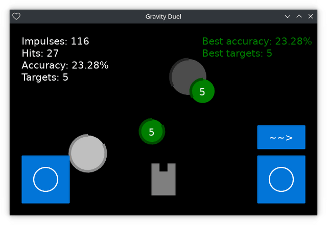

# Gravity Duel

[](https://github.com/thewizardplusplus/gravity-duel/actions/workflows/lint.yaml)



2D puzzle game for Android inspired by various shoot 'em up games reduced to a duel of two players and combined with gravity effects (but only for impulses).

_**Disclaimer:** this game was written directly on an Android smartphone with the [QLua](https://play.google.com/store/apps/details?id=com.quseit.qlua5pro2) IDE and the [LÖVE for Android](https://play.google.com/store/apps/details?id=org.love2d.android) app._

## Features

- entities:
  - the player:
    - the player can only perform one possible action at a time;
    - the possible actions:
      - movement:
        - forward;
        - backward;
        - to the right;
        - to the left;
      - rotation:
        - to the right;
        - to the left;
      - player impulse performing;
  - the target:
    - appearance:
      - at a random point in time;
      - in the segment in front of the player;
    - restricted lifetime:
      - by duration;
      - by quantity of hits of player impulses;
  - the hole:
    - kinds:
      - the black holes;
      - the white holes;
    - appearance:
      - at a random point in time;
      - in the segment in front of the player;
    - restricted lifetime:
      - by duration;
    - change trajectories of player impulses in accordance with gravity effects:
      - the black hole attracts them;
      - the white hole pulls away them;
- game stats:
  - metrics:
    - current:
      - quantity of performed player impulses;
      - quantity of hit targets;
      - accuracy of player impulses;
      - quantity of destroyed targets;
    - best:
      - accuracy of player impulses;
      - quantity of destroyed targets;
  - storing the game stats in the [FlatDB](https://github.com/uleelx/FlatDB) database:
    - save only the best metrics;
    - save only when the best metrics change.

## Building

Clone this repository:

```
$ git clone https://github.com/thewizardplusplus/gravity-duel.git
$ cd gravity-duel
```

Build the game with the [makelove](https://github.com/pfirsich/makelove) tool:

```
$ makelove ( win64 | macos | appimage )
```

Take the required build from the corresponding subdirectory of the created `builds` directory.

## Running

See for details: <https://love2d.org/wiki/Getting_Started#Running_Games>

### On the Android

Clone this repository:

```
$ git clone https://github.com/thewizardplusplus/gravity-duel.git
$ cd gravity-duel
```

Make a ZIP archive containing it:

```
$ git archive --format zip --output gravity_duel.zip HEAD
```

Change its extension from `.zip` to `.love`:

```
$ mv gravity_duel.zip gravity_duel.love
```

Transfer the resulting file to the Android device.

Open it with the [LÖVE for Android](https://play.google.com/store/apps/details?id=org.love2d.android) app.

### On the PC

Clone this repository:

```
$ git clone https://github.com/thewizardplusplus/gravity-duel.git
$ cd gravity-duel
```

Then run the game with the [LÖVE](https://love2d.org/) engine:

```
$ love .
```

## Documentation

- Table of Contents ([EN](docs/README.md) / [RU](docs/README_ru.md)):
  - Summary ([EN](docs/summary.md) / [RU](docs/summary_ru.md))
  - Gameplay ([EN](docs/gameplay.md) / [RU](docs/gameplay_ru.md))
  - Controls ([EN](docs/controls.md) / [RU](docs/controls_ru.md))

## License

The MIT License (MIT)

Copyright &copy; 2021-2022 thewizardplusplus
