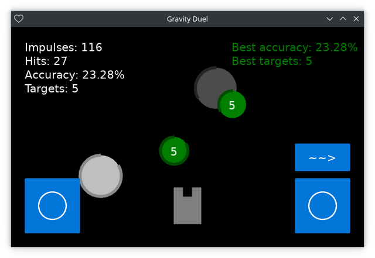

# Управление ([EN](controls.md) / RU)

[<< Назад](README_ru.md)

Управление кораблëм игрока:

- перемещение:
  - вверх:
    - при помощи клавиатуры: <kbd>W</kbd>;
    - при помощи мыши/сенсорного экрана: левый джойстик вверх;
  - вниз:
    - при помощи клавиатуры: <kbd>S</kbd>;
    - при помощи мыши/сенсорного экрана: левый джойстик вниз;
  - вправо:
    - при помощи клавиатуры: <kbd>D</kbd>;
    - при помощи мыши/сенсорного экрана: левый джойстик вправо;
  - влево:
    - при помощи клавиатуры: <kbd>A</kbd>;
    - при помощи мыши/сенсорного экрана: левый джойстик влево;
- вращение:
  - вправо:
    - при помощи клавиатуры: <kbd>Right Arrow</kbd>, <kbd>L</kbd>;
    - при помощи мыши/сенсорного экрана: вращение правого джойстика по часовой стрелке;
  - влево:
    - при помощи клавиатуры: <kbd>Left Arrow</kbd>, <kbd>J</kbd>;
    - при помощи мыши/сенсорного экрана: вращение правого джойстика против часовой стрелки;
- производство энергетических импульсов:
  - при помощи клавиатуры: <kbd>Enter</kbd>, <kbd>Space</kbd>;
  - при помощи мыши/сенсорного экрана: <kbd>~~></kbd>.

Клавиши клавиатуры могут быть изменены в конфиге `keys_config.json`. Значения выбираются на основе https://github.com/tesselode/baton#usage.
